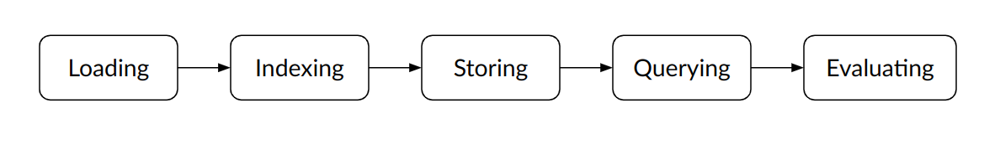
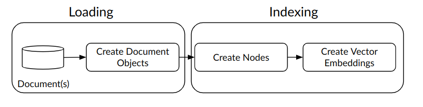
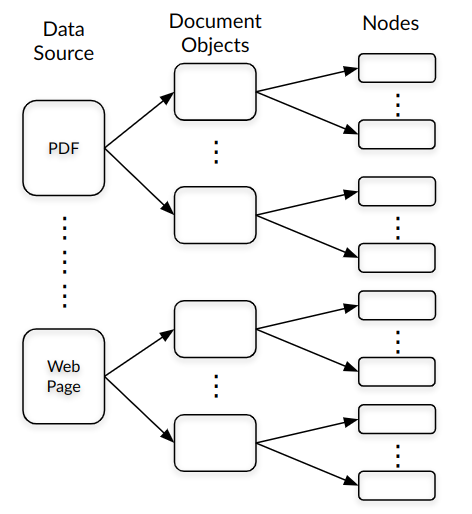
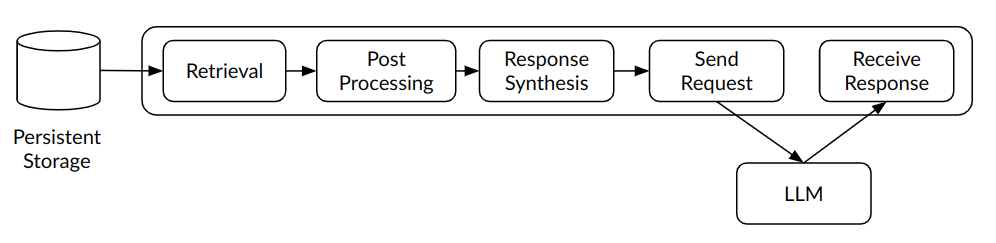

 # Retrieval Augmented Generation using LlamaIndex

 In this part we will try to understand the LlamaIndex framework and go through a basic implementation of RAG using LlamaIndex.

## What is LlamaIndex?
LlamaIndex is a framework which can be used to implement RAG. In LlamaIndex, RAG is broken down into the following stages:

- Loading — Load data to create the relevant context.
- Indexing — Create efficient structures (indices) to retrieve data later.
- Storing — Store indices for retrieving relevant data.
- Querying — Retrieve relevant data using indexes.
- Evaluation — Evaluate the response(s) generated using RAG.


<figure style="text-align: center;">
  
  <figcaption>RAG Stages. Source: <a href="https://docs.llamaindex.ai/en/stable/getting_started/concepts.html">Llamaindex - Concepts</a></figcaption>
</figure>


## Explanation
Now let’s look at the LlamaIndex RAG stages in a bit more detail.

### a. Loading and Indexing

<figure style="text-align: center;">
  
  <figcaption>Stages in Loading and Indexing</figcaption>
</figure>

**i) Loading** - Data can be present in different formats (pdfs, markdowns, web pages etc.). For each format we need to read the data, this in turn would require a corresponding Reader/Data Connector. Data Connectors read different forms of data. Calling the appropriate reader for the specific data type and loading all content in memory should be handled in this stage. LlamaIndex has different data connectors for reading data available in [LlamaHub](https://docs.llamaindex.ai/en/stable/understanding/loading/llamahub/).

Each data source is converted to a list of Document objects. These objects contain data and its corresponding metadata.

**ii) Indexing** - Indices are build on top of Document objects. The Document objects are further broken down into list of Nodes. Each Node contains chunk of data, metadata to indicate the source of this data and its relationship to other Nodes. Subsequently, we create vector embeddings of the data in each Node and store it alongwith the data and its metadata. The diagram below depicts Loading & Indexing.

Refer to [How Each Index Works](https://docs.llamaindex.ai/en/stable/module_guides/indexing/index_guide/), to understand the different indexes and their corresponding query methodology.

<figure style="text-align: center;">
  
  <figcaption>Result of Loading and Indexing</figcaption>
</figure>

**What are Vector Embeddings?** 

Vector embeddings are numerical representation of the data. When the user supplies a query, we generate vector embeddings of the query and match the embeddings closest to the embedding stored for the data. This helps us to retrieve context relevant data for the specific query. LlamaIndex by default uses the *text-embedding-ada-002* embedding.

### b. Storing
 
When indices are created they reside in memory. These indices can be stored in a persistent storage so as to avoid re-loading and/or re-indexing data for every query initiated. The container class for persistent storage is StorageContext. StorageContext enables different types of stores to store different kind of objects.

StorageContext provides 3 interfaces for persistent storage:

- **Document Store Interface**: interface for implementing a document store.
- **Index Store Interface**: interface for implementing a store for storing index metadata.
- **Vector Store Interface**: interface for implementing a store for storing embedding vectors.

LlamaIndex provides different types of stores using these interfaces:
- **Document stores**: for storing node objects created from documents.
- **Index stores**: for storing index metadata.
- **Vector stores**: for storing embedding vectors.
- **Graph stores**: for storing knowledge graphs. This store corresponds to using the KnowledgeGraphIndex.
- **Chat Stores**: where chat messages are stored and organized.

One of the most frequently used Index is the VectorStoreIndex. Vector Stores are used to store VectorStoreIndex. As the Nodes generated using VectorStoreIndex contain the data, its index and the corresponding vector embeddings, it is common for many vector stores to store data alongwith the index and vector embeddings.

### c. Querying

<figure style="text-align: center;">
  
  <figcaption>Querying Stages</figcaption>
</figure>

Querying in LlamaIndex involves creating context relevant prompt using external knowledge sources. We also include sending the context rich prompt to the LLM and receiving the response as being part of the Querying stage.

- **Retrieval** - Retrieves the relevant data based on the index generated.
- **Post-Processing** - Filter data based on other criteria set by the user.
- **Response Sythesis** - Create the prompt based on filtered data and query initiated by the user.
- **Send Request** - Send the final prompt to the LLM.
- **Receive Response** - Receive the response from the LLM.

Although the last two stages can be considered to be part of the Response Synthesis stage, they have been enumerated to bring clarity to the querying stage.

## Example
Let's look at an end-to-end example of using RAG to generate a data specific prompt and receive the response from the LLM.

### a. Setup 

This code was run on Google Colab. Install the following dependencies and initialize the OpenAI key.

```python
# install the dependencies
!pip install cohere
!pip install openai
!pip install tiktoken
!pip install llama-index
!pip install pypdf

import os
import openai
# set your openapi key
os.environ["OPENAI_API_KEY"] = "sk-..."
openai.api_key = os.environ["OPENAI_API_KEY"]
```
### b. RAG using LlamaIndex

```python
from llama_index.core import (
    VectorStoreIndex, SimpleDirectoryReader,
    StorageContext, load_index_from_storage
) 

# If the indices are being created for the first time. 
# We create the indices and store it under the "storage" folder.
# If the indices are already created and stored in the "storage"
# folder then we load the indices from that directory.

# check if storage already exists
PERSIST_DIR = "./storage"
if not os.path.exists(PERSIST_DIR):
    # load the documents and create the index
    documents = SimpleDirectoryReader("data").load_data()
    index = VectorStoreIndex.from_documents(documents)
    # store it for later
    index.storage_context.persist(persist_dir=PERSIST_DIR)
else:
    # load the existing index
    storage_context = StorageContext.from_defaults(persist_dir=PERSIST_DIR)
    index = load_index_from_storage(storage_context)

# create a query_engine from the index.  
query_engine = index.as_query_engine()

# A query engine takes in a natural language query, 
# generates a relevant prompt based on the retrieved indices, 
# and returns a rich response.
response = query_engine.query("<insert query here>")
print(response)
```

### Explanation
The example above demonstrates how to implement RAG using LlamaIndex. In our setup, the "data" folder contains all relevant documents to be read and indexed. The index of the documents will be stored in a folder called "storage".
1. Loading and Storing: We read content from the "data" folder, using the interface SimpleDirectoryReader. SimpleDirectoryReader is used to load data from different sources and format it into Document objects. It creates documents out of every file in a given directory. It can handle a variety of formats including Markdown, PDFs, Word documents, images, audio, and video. The "load_data()" function creates a list of Document objects. If the indexes had already been generated (we perform a naive check to see whether the "storage" folder exists or not), they are loaded using "load_index_from_storage" interface.
2. Indexing: VectorStoreIndex.from_documents() constructs index from the list of documents provided. This index can be used for querying.
3. Querying: After we create a VectorStoreIndex we use "as_query_engine()" method to create a query engine from the index. A query engine is an interface that allows us to perform queries on the underlying index. This query engine can be used to perform semantic search over documents in the index. We initiate our queries using "query_engine.query()". Query is performed on the data indexed by the query engine. "query_engine.query()" takes a string argument which represents the query we want to perform. The response contains the results of the query, information such as the documents or parts of documents that best match the query, the scores of the matches, and other metadata.

This article demonstrates a basic way to understand and implement RAG using Llamaindex. In the next article we would delve a little deeper into different use cases for RAG using LlamaIndex.

## References

1. [LlamaIndex Documentation](https://docs.llamaindex.ai/en/stable/index.html)
2. [High-Level Concepts](https://docs.llamaindex.ai/en/stable/getting_started/concepts/)
3. [Storing - Basic Concept](https://docs.llamaindex.ai/en/stable/understanding/storing/storing/)
4. [Storing - Module Guide](https://docs.llamaindex.ai/en/stable/module_guides/storing/)
5. [Querying](https://docs.llamaindex.ai/en/stable/understanding/querying/querying/)